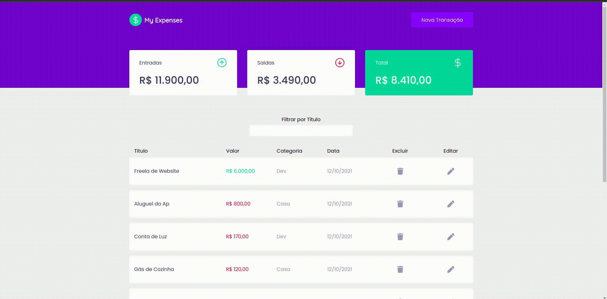

   

## 🙂 Demonstration

  :moneybag: Manage your money. Project developed during the second Bootcamp Ignite module | <a href="https://github.com/Rocketseat">@Rocketseat</a>

   Made with 💖 by
    <a href="https://github.com/SilvioFelix32">Silvio Félix.
  

## Dependencies

- [axios](https://ghub.io/axios): Promise based HTTP client for the browser and node.js
- [miragejs](https://ghub.io/miragejs): A client-side server to help you build, test and demo your JavaScript app
- [polished](https://ghub.io/polished): A lightweight toolset for writing styles in Javascript.
- [react](https://ghub.io/react): React is a JavaScript library for building user interfaces.
- [react-dom](https://ghub.io/react-dom): React package for working with the DOM.
- [react-icons](https://ghub.io/react-icons): SVG React icons of popular icon packs using ES6 imports
- [react-modal](https://ghub.io/react-modal): Accessible modal dialog component for React.JS
- [react-scripts](https://ghub.io/react-scripts): Configuration and scripts for Create React App.
- [styled-components](https://ghub.io/styled-components): Visual primitives for the component age. Use the best bits of ES6 and CSS to style your apps without stress
- [uuid](https://ghub.io/uuid): RFC4122 (v1, v4, and v5) UUIDs
- [web-vitals](https://ghub.io/web-vitals): Easily measure performance metrics in JavaScript

# :page_facing_up: License

This project is under the [MIT license](./LICENSE).
Made with 💖 by [Silvio Félix](https://www.linkedin.com/in/silviofelix32/). 

Thank you! 🌠
